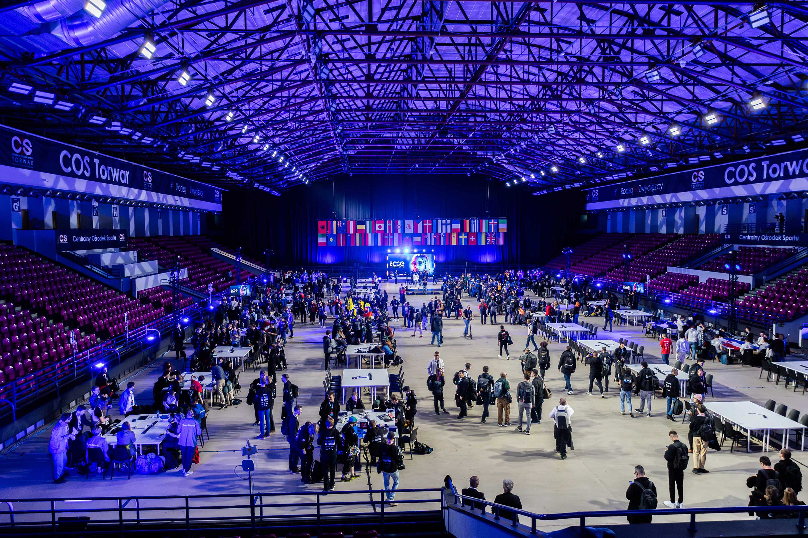
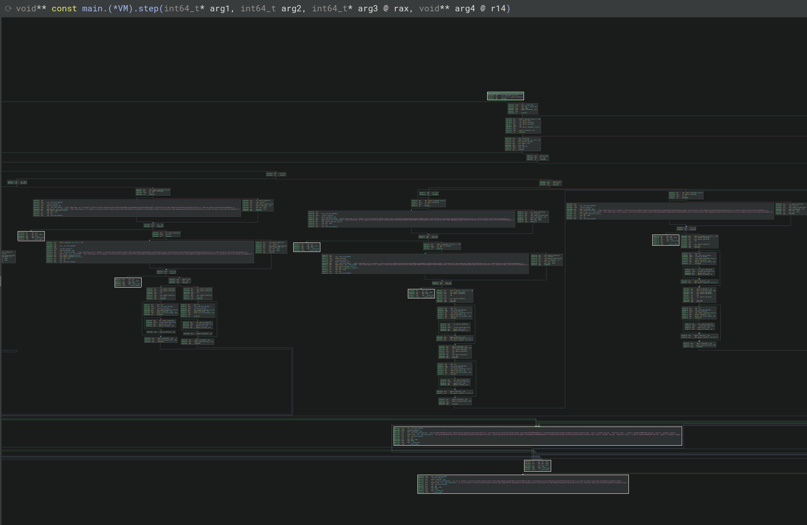

So..... I went to Poland to represent CrOwOatia (team Croatia) at the European CyberSecurity Challenge.



This started when I thought in January when I saw that my uni offered a class on _academic skills_ in cybersecurity which seemed cool so I signed up. Then there was the national competition which I attended with some friends which had experience and due to one team giving their spot up we qualified for further selection into the national ECSC team.

Now, at the time of qualification I barely knew cryptography and couldn't tell you how to even start a reversing task. Now thankfully we had officially organised training sessions where we had some good results.

## OpenECSC

Right before ECSC the openECSC competition is held and I thought it might be fun to participate so I did. What was not expected was that I ended up 30th.

How I managed that? I seriously couldn't tell you. And weirdly, it wasn't even due to my work in cryptography (my main category) but reversing? Turns out, once you learn the tools, the skills transfer

In openECSC reversing I got more familiar with _VM_ reversing tasks, or in other words it's not a full VM in the standard sense but just that it executes some random bytecode you have to rev. All well and good, interesting but I thought it was too simple to come up in ECSC

## ECSC Jeopardy - _Cryptic VM_

What was that I thought literally 2 days earlier? ~Too simple to come up~. So we're given a standard rev task binary which checks the flag.

It is a stripped binary, but it was written in Golang, and nothing in Go ever ends up fully stripped. A massive binary and as the task title said it was a VM. An obviously suspicious function was found called `VM_STEP`. Ok simple enough open that up let's look at it and then the VM part hit me. From _somewhere_ (never ended up figuring where) it reads bytes and uses a dispatcher to perform actions in some sort of simple machine code.

Based on the dispatcher I could figure out how the code works but we have the issue that we can't figure out where it reads anything from. So I finished my static analysis with a python script that I could input all the data I will extract at one point and get like mnemonic-esque code I could figure out (think like ADD/MUL...). The dispatcher is literally a set of comparisons followed by functions `read8` or `read32` which read a bit more of memory and perform operation on those values. That was the simple part.


Every one of these horizontal blocks (small subsection) is just a comparison on `rax` which determines the command

So when you learn reverse engineering for 3 months you might not cover everything and for me that was dynamic rev. Like I could open gdb and do something... However by a guess on the complexitiy of instructions I needed to extract ~50 steps. Thankfully ECSC is a **team** competition so I was not doomed.

A friend and team captain, [Tonik](https://kukec.dev), thankfully is a better rev player who knows dynamic rev. Via libdebug and a good breakpoint we could extract everything (At the time of writing this I still don't know libdebug :(, working on it!!). The whole libdebug python script boils down to 3 breakpoint functions which is not that bad.

So libdebug data and my mnemonic converter we got something out. Sample output:
```
0x0000	PUSH_CONST	7
0x0005	DATA/UNKNOWN (0x07)
0x0006	PUSH_CONST	16843009
0x000B	DATA/UNKNOWN (0x1010101)
0x000C	MUL
0x000D	POP_REG	0
0x000F	PUSH_CONST	66
0x0014	DATA/UNKNOWN (0x42)
0x0015	PUSH_CONST	16843009
0x001A	DATA/UNKNOWN (0x1010101)
0x001B	MUL
0x001C	PUSH_REG	0
0x001E	XOR
0x001F	PUSH_MEM	0
0x0021	PUSH_CONST	16843009
0x0026	DATA/UNKNOWN (0x1010101)
0x0027	MUL
0x0028	EQ
0x0029	PUSH_REG	0
0x002B	PUSH_CONST	236
0x0030	DATA/UNKNOWN (0x00)
0x0031	DATA/UNKNOWN (0xEC)
0x0032	PUSH_CONST	16843009
0x0037	DATA/UNKNOWN (0x1010101)
0x0038	MUL
0x0039	XOR
0x003A	POP_REG	0
0x003C	PUSH_CONST	168
```

So at this point we have a stack based 32 bit xor cypher. Due to the needed speed of solution another teammate got the answer from chatgpt but the solution boils down to just xoring hardcoded values (A lot of PUSH_CONST). From which we get the flag: `ECSC{4_vm_h45_b33n_pl4nt3D!_c0ngr4tZ!}`

What I learned is that I really need to learn dynamic rev.

## ECSC Attack/Defence - _Heavensent_

So there seems to be a trend (or at least it seems to me) to put AD services which are usually crypto based in compiled binaries which is usually fine.

Now a big part of AD is looking at network logs to figure out what's happening which I would have done for Heavensent but........ (drum roll please) all communication was done through GNU Radio protocol (????) and the given binary was compiled Angelscript (???)


Ok so no network logs, no radare2 or binary or ghidra to save me.... We noticed that this task was on another level right away so I was soloing it this time around, the rest of the team focused on other services.

Now, why does it matter that I was alone? Well because I failed to do anything on this task for 8 straight hours. I didn't wanna give up though.

### Part 1 - the service

So the service was relatively simple. It was a radio station where you could register an operator and get random broadcast, except specific operators had flags (we knew operator ids but not their passwords). 

Another part was related to encryption schemes of your own broadcasts which seemed more realistic that I could crack so I decided to search a bit more into that.

Angelscript was compiled in a binary we received and with that part 1 was to reverse engineer that. We got some extra utility functions for it to run the binary because it wasn't a standard ELF or PE you could just do `./heavensent`.

We got a python based client for interaction with everything. A lot of people (including AI chatbots), couldn't figure out how to use it so they released a newer client somewhat into the competition. At that moment I could do the most impressive thing about it and say "yeah don't mind that my client is better and specific to my needs :)"

### Part 2 - the blunder

I might have mentioned that I didn't really know how to do dynamic rev at that point so I figured let's start with simple static and see where we go. What I thought was that due to the fact that we received code for running the Angelscript I would have to statically reverse it and stopped thinking about dynmaic. _maybe a mistake_

There exists no static disassembler for angelscript. If I wanted to do it I would have to write it. While I got decent work into it, it wasn't going anywhere. Sadly however hard I tried it wouldn't be enough. With crypto knowledge I did learn some stuff about the whole process and I know what in general I had to do but with only half of the actual info from the rev I couldn't finish it.

### Part 3 - 2 months later

**LEARN DYNAMIC REV**

We didn't just get the compiled Angelscript, we got the standard C runner code. What you _could_ do if you think hard enough was insert a bit of code which outputs what angelscript does as it executes or in other words you can make it disassemble itself.

I started learning libdebug because it seems that the biggest blocker to my knowledge in rev up to date is literally just dynamic. Maybe in 3 months time, when national qualifiers start, I will actually know what I'm doing.

## The team

Overall though, I am not or do not intend to work in cybersecurity which is why having an amazing team of people to play CTFs on the weekend is something I am super grateful for. Hopefully I make it into the team for ECSC 2026 so I can fail dynamic rev all over again :3
