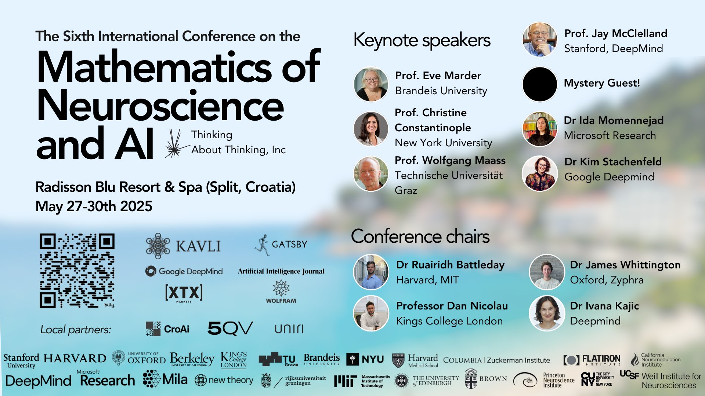
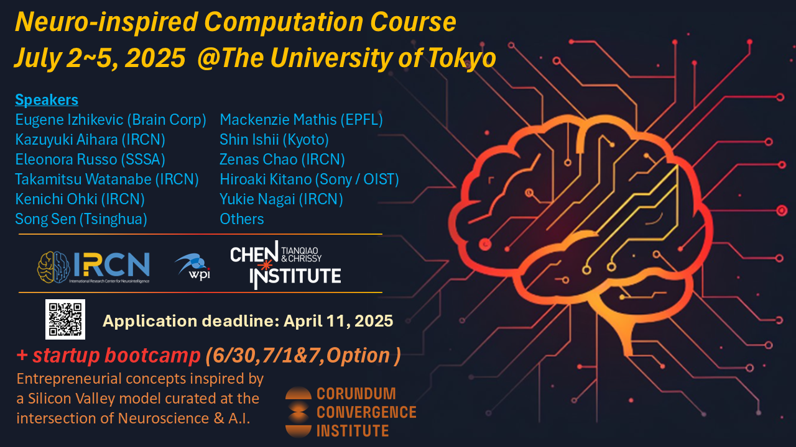
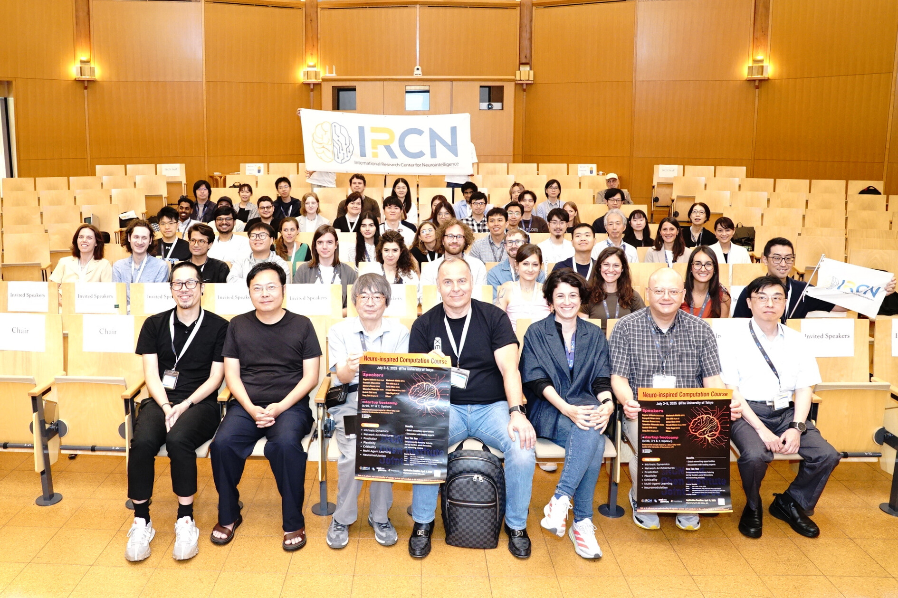

Usually during the summer I decide to take up some _sidequest_ to learn something new and be slightly productive over the summer. Usually it was like learn to make a website or something simple. 

However what happened on accident was that I didn't have a simple task this year, it was closer to accidentally starting the main quest.

## Late May - first poster presentation

So in late May (28th to 30th) the 6th International Conference on the Mathematics of Neuroscience and AI (informally neuromonster so I'm gonna use that) was held in Split. Now this is a somewhat smaller and more informal conference so when I saw it I had to apply.

Right before that I finished most of the theoretical work on a random side project for class (check the projects page for Moore machines). Now what this meant was that I could apply for a poster. There was no way I was gonna get it but I should just apply right?

### Part 1 - scrambling for the poster

There is no way to get it right???? Right????? I woke up one day to an email saying I've been selected to present a poster based on my abstract. Now I did have most of the theoretical work squared away and enough material for the poster but.....

#### How to make a scientific poster 101
1. Panic
2. Email your professor for help
3. Panic part 2
4. Powerpoint !!

Ok so I did manage to make a poster basically just in time, having it printed literally 2 days before I had to leave. Ok so I have a poster but no way anyone would be too interested in it so the fact it was a bit bad in some aspects is fine.

### Part 2 - people were interested

Once I got there though I met the most amazing people from all over but especially a group from Budapest who I ended up hanging out with the whole time. I met a lot more really cool people there and the important bit people liked my poster (????????). So now because of an application on a whim I have a scientific poster presentation on the CV and a bunch of academic connections.

> You can see my poster and a basic simulation on my [GitHub](https://github.com/eika-sia/hopfield_sequential) but I recommend going over to the projects tab.

It was an amazing atmosphere and hopefully I will attend again next year (just gotta make a research project to present rq ykyk no issue). A lot of people attend every year just to hang out which seems so fun. At this point I was convinced this was more of a fluke than a rule and thought I peeked here. Did I mention I applied for some cool workshop in Tokyo for which there was no way I was gonna get accepted due to needing financial support.

## Late June, early July - Tokyo

> There was no way I was gonna get in

At this point this may as well become the theme of my summer. So after the first poster presentation ever I did have some updates in my research towards a full fledged framework so I decided to apply

The program was the IRCN and Chen Institute Joint Course on Neuro-inspired Computation which takes in students for a week and gives you an incredible chance to learn, discuss and present your research to an amazing cast of researchers.

As you can see the application deadline is before neuromonster so it was super "I'm totally not gonna get in"

### Part 1 - the application chaos

My application was submitted on the day of the deadline. Now I needed to submit a bunch of personal data, a cv, a motivational letter, a letter requesting financial support and a letter of recommendation. 

Now if you're studying for your masters or PhD you have a connection to a mentor who can write you that letter. If you are an undergrad you just don't. Thankfully if we go way back to around January and that random class project with which I went to neuromonster I did have someone I _could_ ask. So my mentor did actually help me and we filled out that application and I honestly kind of forgot about it.

### Part 2 - second poster and failing classes

So one bright morning I got up and saw that I had a bunch of unread emails. One of them from a Japanese name? Turns out I did get in and I did get all the financial support. What that meant was that I was about to go to Tokyo for 5 days for free which is just insane.

So now as an experienced poster maker I only needed to panic once but I did get my poster in order, sadly not available on the internet anywhere as of yet (email me or something if you are curious).

There was just one issue. If I wanted to go to Tokyo for this workshop it means failing 2 of my classes because I would miss my finals. Which could give someone a bit of doubt about going.

I missed my finals.

### Part 3 - Tokyo :0

So to be fair I really did want to go to Tokyo because it's an incredible experience of it's own which got 10x better once I found out I could extend my stay there for extra 5 days (which I did in a heartbeat) I just had to pay for the hotel a bit extra. So 10 days in Tokyo for 300 euros is decent.

The workshop was amazing and honestly not so much for the lectures which were interesting as much as how personal it ended up being. So when I saw I got accepted my first thought was "oh so another like 300-500 people got accepted it's gonna be interesting". I was wrong by a scale of 10x. There were a total of 35 students including me. That resulted that I had the ability to talk 1 on 1 with so many professors including Eugene Izhikevic who is honestly such a big figure to me because his book got me started.

Honestly post these two conferences I felt like I actually could do something in this field and being treated as an equal in the conversation rather than a student was just so amazing. Obviously throughout the summer I continued working on my research but that's for another post. Because it's time for!

## August - Summer job in Višnjan School of Astronomy

## October - ECSC??

## The new normal
